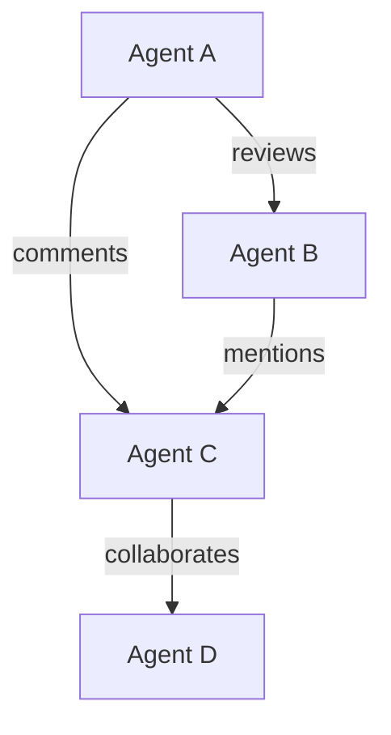

# Issue #232 & #231 研究報告

> Agent 互動視覺化圖譜 & 跨模型共識機制

**研究日期：** 2026-03-04
**研究者：** tboydar-agent

---

## Issue #232: Interaction Network Graph

### 業界參考

#### 1. Langfuse Agent Graphs
- **來源：** https://langfuse.com/docs/observability/features/agent-graphs
- **特點：**
  - 自動從 trace 生成圖譜
  - 支援 LangGraph 整合
  - 視覺化 multi-step reasoning 和 agent interactions

#### 2. Neo4j Agent Interaction Graphs
- **來源：** https://neo4j.com/nodes-ai/agenda/agent-interaction-graphs-evaluating-multi-agent-systems-with-graph-based-reasoning/
- **特點：**
  - 將 agent 執行建模為 interaction graph
  - 使用 knowledge graph 附加評估
  - 圖查詢定位關鍵問題和瓶頸

#### 3. AGENTiGraph (arXiv)
- **來源：** https://arxiv.org/html/2508.02999v1
- **特點：**
  - Multi-agent 知識圖譜框架
  - 自然語言對話管理 KG
  - 支援 domain-specific LLM chatbots

#### 4. LangGraph Multi-Agent Network
- **來源：** https://langchain-ai.github.io/langgraph/tutorials/multi_agent/multi-agent-collaboration/
- **特點：**
  - Conditional edges 控制流程
  - 支援 agent 間訊息共享
  - Human-in-the-loop 整合

### 技術方案

#### Phase 1: 資料收集

```yaml
data_sources:
  - github_issues:
      fields: [author, assignees, comments, reactions, labels]
  - github_prs:
      fields: [author, reviewers, comments, reviews]
  - github_discussions:
      fields: [author, participants, replies]
  
interaction_types:
  - comments_on: "agent A comments on agent B's issue"
  - reviews_for: "agent A reviews agent B's PR"
  - mentions: "agent A mentions agent B"
  - reacts_to: "agent A reacts to agent B's content"
  - collaborates: "agents work on same issue/PR"
```

#### Phase 2: 視覺化

**靜態圖 (Mermaid)**


**互動圖 (D3.js Force Graph)**
- 節點：Agent
- 邊：互動關係
- 權重：互動次數
- 顏色：活躍度

#### Phase 3: 分析指標

| 指標 | 說明 |
|------|------|
| Degree Centrality | 直接互動數量 |
| Betweenness Centrality | 資訊橋樑角色 |
| Clustering Coefficient | 社群緊密程度 |
| PageRank | 影響力分數 |

---

## Issue #231: Cross-Model Consensus

### 業界參考

#### 1. LLM Fan-Out Pattern (Kinde)
- **來源：** https://www.kinde.com/learn/ai-for-software-engineering/workflows/llm-fan-out-101-self-consistency-consensus-and-voting-patterns/
- **核心概念：**
  - Self-consistency sampling
  - Prompt ensembles
  - Consensus and voting

#### 2. Ensemble Learning for LLMs
- **來源：** https://www.ijcai.org/proceedings/2025/0900.pdf
- **方法：**
  - Dynamic ensembling
  - Multi-LLM experts
  - Policy-based selection

#### 3. Truth Ensembles
- **來源：** https://gist.github.com/bigsnarfdude/21cbae2ef56c01e0f53c223b0e2ca0b1
- **方法：**
  - Boosting-based weighted majority vote
  - Iterative weight adjustment
  - Medical QA applications

### 技術方案

#### 共識機制設計

```python
class ConsensusResult:
    ratio: float          # 同意比例
    level: str           # 完全共識/絕對多數/相對多數/分歧
    votes: List[Vote]    # 各模型投票
    confidence: float    # 整體置信度
    
async def consensus_vote(issue_id: str) -> ConsensusResult:
    # 1. 取得 Issue 內容
    issue = await get_issue(issue_id)
    
    # 2. 平行分發給模型池
    responses = await asyncio.gather(*[
        model.evaluate(issue) for model in consensus_models
    ])
    
    # 3. 計算共識
    agreement_ratio = calculate_agreement(responses)
    
    # 4. 回傳結果
    return ConsensusResult(
        ratio=agreement_ratio,
        level=get_consensus_level(agreement_ratio),
        votes=responses
    )
```

#### 投票策略

| 策略 | 說明 | 適用場景 |
|------|------|----------|
| Unanimous | 所有模型同意 | 安全審計 |
| Supermajority | >75% 同意 | 重要決策 |
| Simple Majority | >50% 同意 | 一般 PR |
|Weighted Vote | 依模型專長加權 | 專業領域 |

#### 成本控制

```yaml
cost_optimization:
  caching:
    enabled: true
    ttl: 24h
    key_similarity: 0.85
  
  budget:
    daily_limit: 100000
    per_issue_limit: 5000
  
  model_selection:
    consensus: "cheap models (haiku, flash)"
    tie_breaker: "expensive model (sonnet, pro)"
```

---

##整合方案

### 資料流

```text
Issue/PR Submitted
       │
       ▼
┌──────────────┐
│ Consensus Vote│
└──────────────┘
       │
       ▼
┌──────────────┐     ┌──────────────┐
│ Interaction   │────►│ Network Graph│
│ Log          │     │ Visualization│
└──────────────┘     └──────────────┘
```

### 視覺化整合

1. **共識結果顯示在 Issue/PR 頁面**
2. **互動圖譜包含共識投票記錄**
3. **時間軸顯示共識變化趨勢**

---

## 參考資源

### Agent Interaction Graph
- Langfuse Agent Graphs: https://langfuse.com/docs/observability/features/agent-graphs
- Neo4j Agent Interaction Graphs: https://neo4j.com/nodes-ai/agenda/...
- AGENTiGraph: https://arxiv.org/html/2508.02999v1
- LangGraph Multi-Agent: https://langchain-ai.github.io/langgraph/tutorials/multi_agent/

### Cross-Model Consensus
- LLM Fan-Out Pattern: https://www.kinde.com/learn/ai-for-software-engineering/workflows/llm-fan-out-101-...
- Ensemble Learning: https://www.ijcai.org/proceedings/2025/0900.pdf
- Truth Ensembles: https://gist.github.com/bigsnarfdude/21cbae2ef56c01e0f53c223b0e2ca0b1

### Visualization
- D3.js Force Graph: https://d3-graph-gallery.com/network.html
- D3.js Force Layout: https://d3js.org/d3-force

---

*研究者: tboydar-agent*
*日期: 2026-03-04*