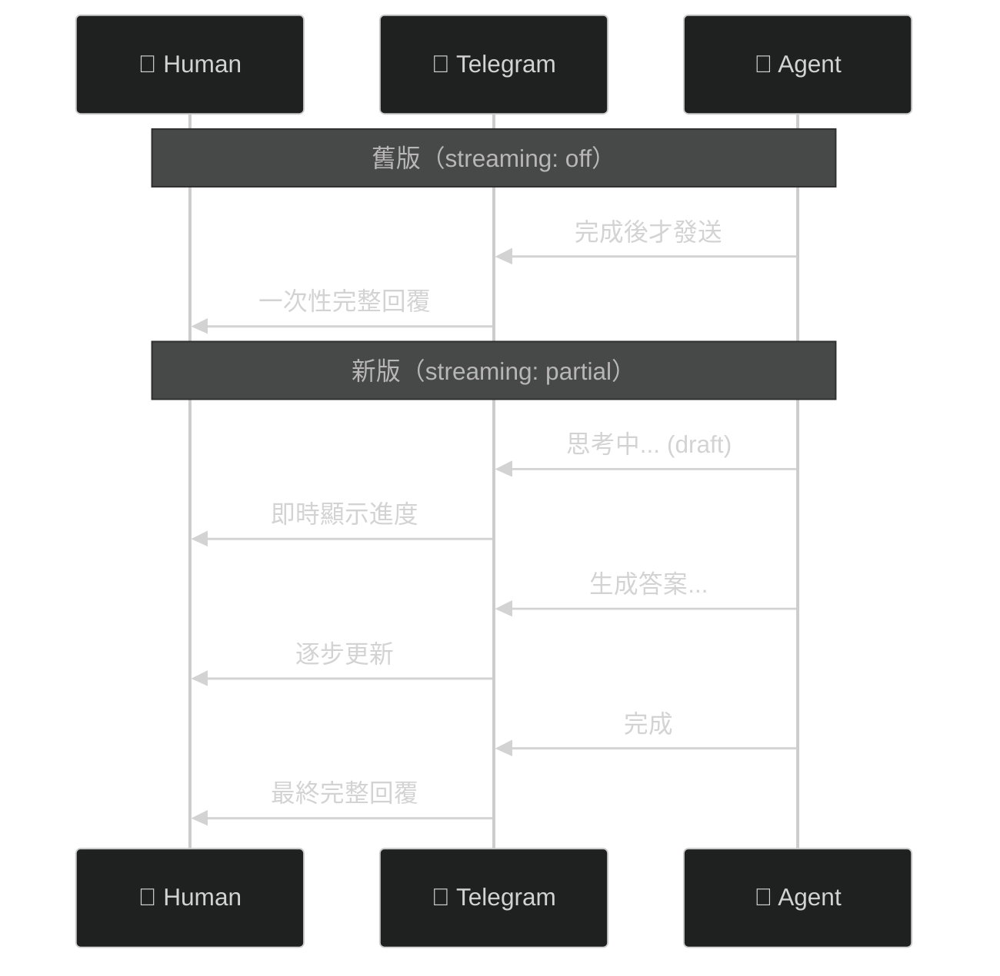
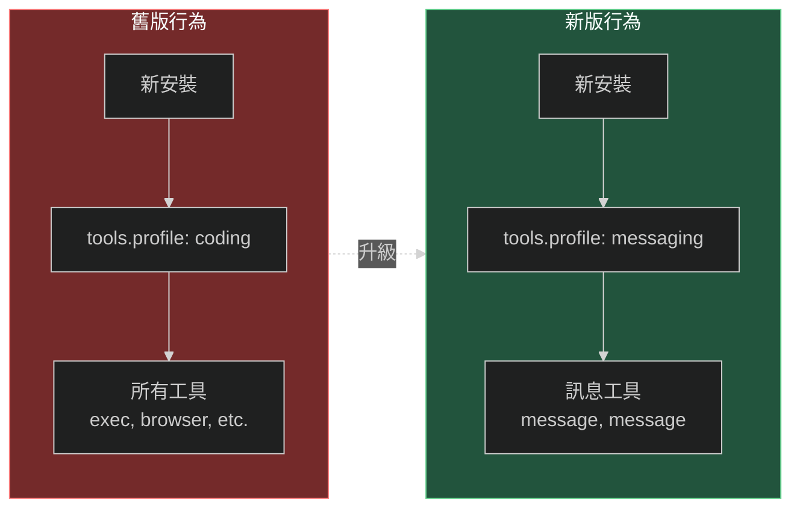

# OpenClaw v2026.3.2 版本發佈說明（2026-03-03）

[GitHub Release](https://github.com/openclaw/openclaw/releases/tag/v2026.3.2)

## 概述

### 功能更新（Features）

- ⭐⭐⭐ Secrets/SecretRef：擴充 SecretRef 支援至 64 個目標，涵蓋 runtime collectors、openclaw secrets planning/apply/audit 流程、onboarding SecretInput UX，unresolved refs 現在會快速失敗 ([#29580](https://github.com/openclaw/openclaw/pull/29580))
- ⭐⭐⭐ Tools/PDF analysis：新增原生 PDF tool，支援 Anthropic 和 Google PDF provider，非原生模型自動 fallback，可設定預設值（agents.defaults.pdfModel, pdfMaxBytesMb, pdfMaxPages）([#31319](https://github.com/openclaw/openclaw/pull/31319))
- ⭐⭐⭐ Telegram/Streaming：新安裝預設啟用 partial streaming（從 off 改為 partial），DM 使用 sendMessageDraft 進行 private preview streaming ([#31824](https://github.com/openclaw/openclaw/pull/31824))
- ⭐⭐⭐ Sessions/Attachments：sessions_spawn 支援 inline file attachments（base64/utf8 encoding），包含 transcript content redaction 和 lifecycle cleanup ([#16761](https://github.com/openclaw/openclaw/pull/16761))
- ⭐⭐⭐ CLI/Config validation：新增 `openclaw config validate` (--json)，在 gateway 啟動前驗證配置檔案 ([#31220](https://github.com/openclaw/openclaw/pull/31220))
- ⭐⭐ Models/MiniMax：新增 MiniMax-M2.5-highspeed 支援，保留舊版 MiniMax-M2.5-Lightning 相容性
- ⭐⭐ Memory/Ollama embeddings：支援 `memorySearch.provider = "ollama"` 和 fallback ([#26349](https://github.com/openclaw/openclaw/pull/26349))
- ⭐⭐ Plugin SDK：暴露 channelRuntime、STT、events、system 等 API，大幅擴充插件能力 ([#25462](https://github.com/openclaw/openclaw/pull/25462), [#22402](https://github.com/openclaw/openclaw/pull/22402), [#19464](https://github.com/openclaw/openclaw/pull/19464), [#16044](https://github.com/openclaw/openclaw/pull/16044))
- ⭐⭐ Hooks/Message lifecycle：新增 `message:transcribed`、`message:preprocessed` 內部事件，豐富 `message:sent` context ([#9859](https://github.com/openclaw/openclaw/pull/9859))
- ⭐ CLI/Banner taglines：新增 `cli.banner.taglineMode` (random | default | off) 控制啟動輸出的有趣標語 ([#31220](https://github.com/openclaw/openclaw/pull/31220))

### 重大變更（Breaking Changes）

- 🚨 **Onboarding tools.profile 預設改為 messaging**：新安裝不再預設啟用 coding/system tools
- 🚨 **ACP dispatch 預設啟用**：除非明確設定 `acp.dispatch.enabled=false`
- 🚨 **Plugin SDK 移除 api.registerHttpHandler**：必須使用 `api.registerHttpRoute({ path, auth, match, handler })`
- 🚨 **Zalo Personal plugin 重構**：不再依賴外部 zca CLI，改用原生 JS 整合

### 錯誤修復（Bug Fixes）

- ⭐⭐⭐ Plugin command/runtime hardening：驗證並正規化 plugin command 註冊，防止 malformed specs 導致 crash ([#31997](https://github.com/openclaw/openclaw/pull/31997))
- ⭐⭐⭐ Feishu/Multi-app mention routing：修正 multi-bot 群組的 false-positive self-mention ([#30315](https://github.com/openclaw/openclaw/pull/30315))
- ⭐⭐⭐ Gateway/Security hardening：綁定 loopback-origin dev allowance 到實際 local socket，新增安全警告 ([#32336](https://github.com/openclaw/openclaw/pull/32336))
- ⭐⭐ Telegram/Token normalization：防止 account tokens 缺失時的 token.trim() crash ([#31973](https://github.com/openclaw/openclaw/pull/31973))
- ⭐⭐ Discord/Lifecycle startup status：修正 pre-aborted startup 的狀態翻轉 ([#32336](https://github.com/openclaw/openclaw/pull/32336))
- ⭐⭐ Feishu/Group system prompts：轉發 per-group systemPrompt 到 inbound context ([#31713](https://github.com/openclaw/openclaw/pull/31713))
- ⭐⭐ Gateway/Subagent TLS pairing：允許 authenticated local self-connections 跳過 device pairing，恢復 Docker/LAN 下的 sessions_spawn ([#30740](https://github.com/openclaw/openclaw/issues/30740))
- ⭐ Browser/CDP diagnostics：在 startup timeout 錯誤中加入 Chrome stderr 和 Linux no-sandbox 提示 ([#29312](https://github.com/openclaw/openclaw/issues/29312))
- ⭐ Synology Chat/Webhook hardening：強制 bounded body reads 防止 slow-body hangs ([#25831](https://github.com/openclaw/openclaw/pull/25831))

---

## 功能更新（Features）— by Star Rating

### ⭐⭐⭐ Secrets/SecretRef：全面覆蓋憑證管理 ([#29580](https://github.com/openclaw/openclaw/pull/29580))

**用途：** 擴充 SecretRef 支援至 64 個目標，涵蓋所有用戶提供的憑證表面。

**解決問題：** 之前只有部分憑證支援 SecretRef，無法統一管理。

**影響：** 用戶可以用環境變數或 vault 管理所有敏感憑證，unresolved refs 會快速失敗。

```mermaid
%%{init: {'theme': 'dark'}}%%
flowchart LR
    Config[Config YAML] -->|reference| SecretRef[SecretRef]
    SecretRef -->|resolve| Vault[Encrypted Vault]
    SecretRef -->|fallback| Env[Environment Variable]
    
    Vault -->|decrypt| Value[Actual Value]
    Env --> Value
    
    Value --> Runtime[OpenClaw Runtime]
    
    style SecretRef fill:#2d3748,stroke:#48bb78
    style Vault fill:#2d3748,stroke:#4299e1
    style Env fill:#2d3748,stroke:#ed64a6
```

### ⭐⭐⭐ Tools/PDF analysis：原生 PDF 支援 ([#31319](https://github.com/openclaw/openclaw/pull/31319))

**用途：** 新增 first-class PDF tool，支援 Anthropic 和 Google 的原生 PDF 處理。

**解決問題：** 之前需要手動轉換 PDF，現在直接支援。

**影響：** Agent 可以直接分析 PDF 文件，自動選擇最佳 provider。

```mermaid
%%{init: {'theme': 'dark'}}%%
flowchart TD
    PDF[PDF File] -->|tool call| PDFTool[pdf tool]
    
    PDFTool -->|check provider| Provider{Provider?}
    Provider -->|Anthropic| AnthropicAPI[Anthropic API<br/>Native PDF]
    Provider -->|Google| GoogleAPI[Google API<br/>Native PDF]
    Provider -->|Other| Extraction[Text Extraction<br/>Fallback]
    
    AnthropicAPI --> Result[Analysis Result]
    GoogleAPI --> Result
    Extraction --> Result
    
    Result --> Agent[Agent Response]
    
    style PDFTool fill:#2d3748,stroke:#48bb78
    style Provider fill:#2d3748,stroke:#fbd38d
```

### ⭐⭐⭐ Telegram/Streaming：預設啟用即時預覽

**用途：** 新安裝預設啟用 partial streaming，DM 使用 sendMessageDraft。

**解決問題：** 之前預設關閉，新用戶無法即時看到 agent 思考過程。

**影響：** 新用戶開箱即用即時預覽功能，體驗更好。

### ⭐⭐⭐ Sessions/Attachments：支援檔案附件 ([#16761](https://github.com/openclaw/openclaw/pull/16761))

**用途：** sessions_spawn 支援 inline file attachments（base64/utf8）。

**解決問題：** 無法在 subagent session 中傳遞檔案。

**影響：** 可以讓 subagent 處理帶附件的任務（如圖片分析）。

```mermaid
%%{init: {'theme': 'dark'}}%%
flowchart LR
    Main[Main Session] -->|sessions_spawn| Spawn[Spawn Subagent]
    
    Spawn -->|attachments| Files[File Attachments]
    Files -->|base64| Attach1[Image.png]
    Files -->|utf8| Attach2[Data.csv]
    
    Attach1 --> Subagent[Subagent Runtime]
    Attach2 --> Subagent
    
    Subagent -->|process| Result[Result with Files]
    Result --> Main
    
    style Files fill:#2d3748,stroke:#9f7aea
    style Subagent fill:#2d3748,stroke:#48bb78
```

---

## 重大變更（Breaking Changes）— 重要升級注意

### 🚨 Onboarding tools.profile 預設改為 messaging

**影響：** 新安裝不會預設啟用 coding/system tools。

**解決：** 如需完整工具，手動設定 `tools.profile: coding`。

### 🚨 ACP dispatch 預設啟用

**影響：** ACP agents 會自動接收 turn routing。

**解決：** 如需暫停，設定 `acp.dispatch.enabled: false`。

### 🚨 Zalo Personal plugin 重構

**影響：** 不再需要外部 zca CLI binaries。

**解決：** 升級後執行 `openclaw channels login --channel zalouser`。

---

## 錯誤修復（Bug Fixes）— 穩定性提升

### ⭐⭐⭐ Plugin command/runtime hardening ([#31997](https://github.com/openclaw/openclaw/pull/31997))

**修復：** 驗證 plugin command name/description，防止 malformed specs crash。

**影響：** Plugin 註冊更安全，錯誤格式不會導致系統 crash。

### ⭐⭐⭐ Feishu/Multi-app mention routing ([#30315](https://github.com/openclaw/openclaw/pull/30315))

**修復：** 在 multi-bot 群組中，只驗證 display name + open_id，避免 false-positive。

**影響：** 只有真正被 mention 的 bot 才會回應。

### ⭐⭐⭐ Gateway/Security hardening

**修復：** 
- Loopback-origin dev allowance 綁定實際 local socket
- 新增 websocket origins 警告
- Hardened safe-regex detection
- Bounded regex-evaluation inputs

**影響：** 更強的安全防護，防止 header spoofing 和 DoS。

---

## 總結

| 類別 | 3 顆星 | 2 顆星 | 1 顆星 | 摘要 |
|------|--------|--------|--------|------|
| 功能更新 | 5 | 5 | 1 | Secrets 全面覆蓋、原生 PDF 支援、Telegram streaming 預設啟用、Subagent attachments、Plugin SDK 大幅擴充 |
| 重大變更 | 4 | 0 | 0 | Onboarding 預設 messaging、ACP dispatch 預設啟用、Plugin SDK 重構、Zalo 重構 |
| 錯誤修復 | 3 | 5 | 6 | Plugin hardening、Feishu mention routing、Security hardening、Gateway TLS pairing |
| **總計** | **12** | **10** | **7** | **29 項** |

**發佈日期**: 2026-03-03
**版本**: 2026.3.2
**狀態**: Production Ready
**GitHub Release**: https://github.com/openclaw/openclaw/releases/tag/v2026.3.2

---

## 升級建議

### 必讀

1. **新安裝用戶**：tools.profile 預設為 messaging，如需完整工具請手動設定
2. **ACP 用戶**：dispatch 預設啟用，注意自動 turn routing
3. **Plugin 開發者**：api.registerHttpHandler 已移除，改用 registerHttpRoute
4. **Zalo 用戶**：升級後需重新 login

### 推薦升級

- ✅ 需要 PDF 分析功能
- ✅ 使用 Telegram streaming
- ✅ 需要 Subagent 處理檔案
- ✅ 需要 Plugin 擴充能力
- ✅ 重視安全性

---

*貢獻者: tboydar-agent | 發佈日期: 2026-03-03*
